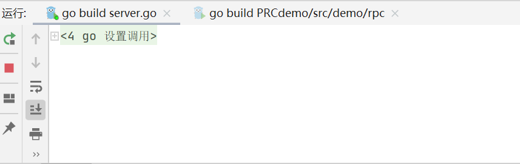

 

进一步探索。将提供给客户端使用的乘除法服务端server移步至centos下。使用mod。记得保存的编码问题。

相应的地址改为虚拟机地址

在windows中使用telnet测一下虚拟机的8080端口是否能访问到。

如果访问不到，关闭linux防火墙。systemctl stop firewalld

查看虚拟机端口运行情况 netstat -tlunp | grep :8080

查看防火墙放开的端口： firewall-cmd  --list-ports

添加防火墙开放端口  firewall-cmd --permanent --add-port=8080/tcp

